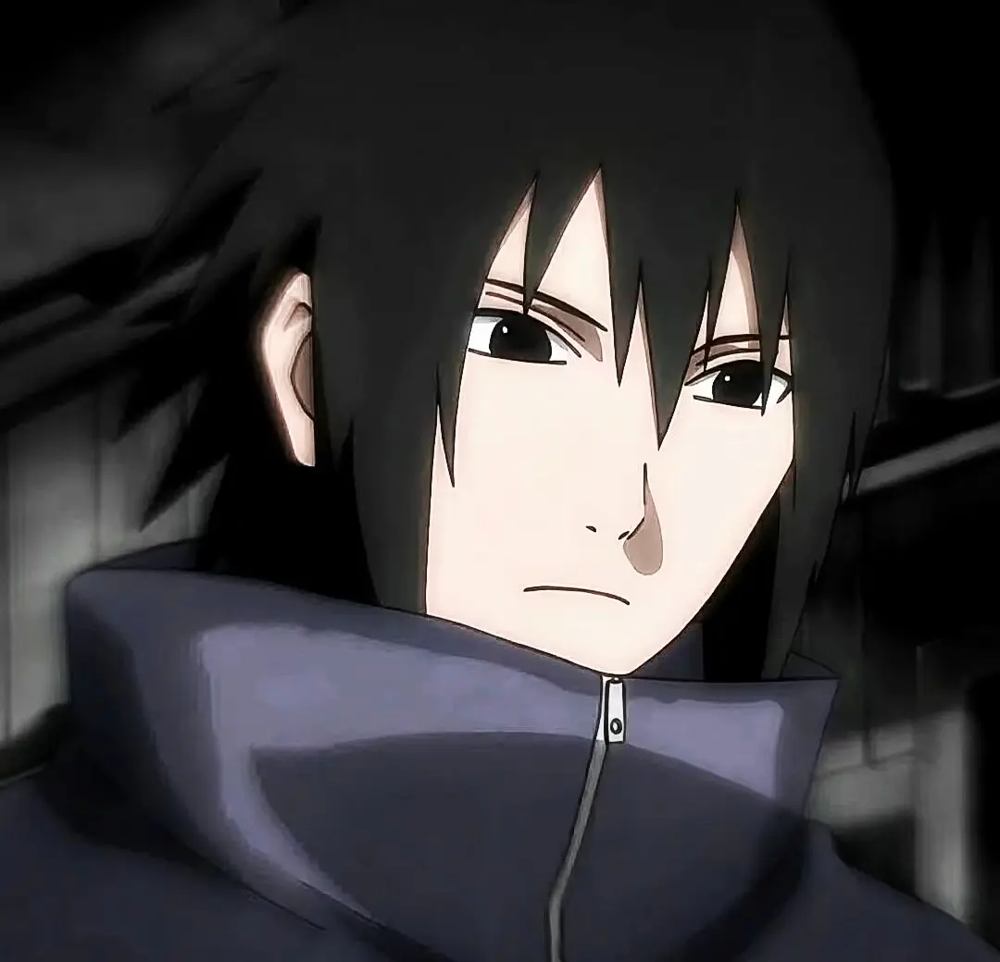
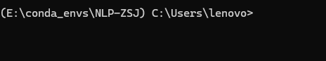
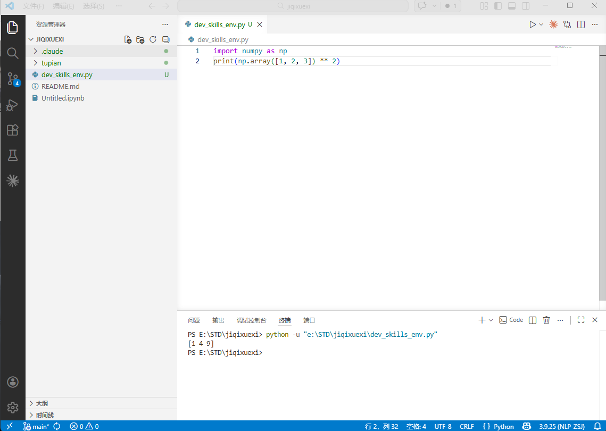

# 宇智波佐助的自我介绍



大家好，我是**宇智波佐助**，我的身份是*木叶隐村的宇智波一族幸存者、复仇者*。以下是我的自我介绍。

---

## 基础档案

### 外貌特征

- 黑色短发，向后梳
- 拥有写轮眼（从三勾玉到轮回眼）
- 左臂被鸣人切断后装上义肢
- 穿着灰色高领上衣和蓝色短裤

### 我的好朋友

1. 漩涡鸣人
2. 春野樱
3. 奈良鹿丸
4. <s>宇智波鼬</s>（曾经是敌人，后来理解了彼此）

### 重要坐标

**住址**：[木叶隐村](https://naruto.fandom.com/zh/wiki/%E6%9C%A8%E5%8F%B6%E9%9A%90%E6%9D%91)

### 日常作息表

| 时间段 | 活动 |
|--------|------|
| 早晨 | 起床，训练 |
| 上午 | 忍术修炼 |
| 中午 | 休息、进食 |
| 下午 | 外出任务 |
| 傍晚 | 思考人生 |
| 晚上 | 休息 |

### 人生信条

> "我要革新这个忍界。"

---

## 我的专业是人工智能

## 我最喜欢的一段代码

```python
def sasuke_mission():
    """
    佐助的使命：革新忍界
    """
    # 寻求力量
    power = seek_power()

    # 理解羁绊
    bonds = understand_bonds(naruto, sakura)

    # 革新忍界
    new_world = revolution_ninja_world()

    return new_world
```



在IDE使用虚拟环境
